```mermaid
erDiagram

    %% ══════════════════════════════════════════════════════════
    %% CORE PIPELINE ENTITIES
    %% ══════════════════════════════════════════════════════════

    IOC {
        string  ioc_raw             "Exact string from analyst input"
        string  ioc_clean           "Normalised: lowercase domain, uppercase hash"
        string  ioc_type            "ip | domain | url | hash_md5 | hash_sha1 | hash_sha256 | cve | unknown"
    }

    TRIAGE_RUN {
        string   run_id             "UUID generated at graph entry"
        datetime started_at         "Timestamp when input_node executed"
        datetime completed_at       "Timestamp when report_node completed"
        float    total_duration_ms  "Wall-clock time for full pipeline"
        bool     escalation_required "True if severity_band == CRITICAL"
    }

    AGENT_STATE {
        string  ioc_raw                "Mirrors IOC.ioc_raw — LangGraph shared state"
        string  ioc_clean              "Mirrors IOC.ioc_clean"
        string  ioc_type               "Mirrors IOC.ioc_type"
        float   composite_score        "Weighted aggregate 0.0–1.0"
        string  severity_band          "CLEAN | LOW | MEDIUM | HIGH | CRITICAL"
        string  verdict_justification  "Plain-English explanation of verdict"
        bool    escalation_required    "Routes to escalation_gate if true"
        string  report_text            "CLI-formatted threat report"
        string  report_html            "Styled HTML report for Jupyter"
        string  arize_trace_url        "Direct link to trace in Arize UI"
    }

    %% ══════════════════════════════════════════════════════════
    %% THREAT INTELLIGENCE ENTITIES
    %% ══════════════════════════════════════════════════════════

    THREAT_INTEL_SOURCE {
        string  source_name         "virustotal | abuseipdb | otx | urlscan | nvd"
        string  base_url            "API root URL"
        string  api_version         "v3 | v2 | v1 | 2.0"
        string  auth_type           "header_key | none"
        string  env_key_name        "e.g. VIRUSTOTAL_API_KEY"
        string  applicable_ioc_types "Comma-sep: all | ip | url | cve"
    }

    THREAT_INTEL_RESULT {
        string  source_name         "FK → THREAT_INTEL_SOURCE"
        string  status              "success | error | unavailable"
        json    raw_response        "Full parsed API response dict"
        float   latency_ms          "Time from request to parsed response"
        string  error_message       "Populated only when status == error"
    }

    SCORE_COMPONENT {
        string  source_name         "FK → THREAT_INTEL_SOURCE"
        float   raw_signal          "Source-specific pre-normalisation value"
        float   normalised_score    "0.0 (clean) – 1.0 (malicious)"
        float   active_weight       "Re-normalised weight after source redistribution"
        float   weighted_contribution "normalised_score × active_weight"
    }

    %% ══════════════════════════════════════════════════════════
    %% SCORING & VERDICT ENTITIES
    %% ══════════════════════════════════════════════════════════

    WEIGHT_CONFIG {
        string  config_name         "BASE_WEIGHTS | CVE_WEIGHTS"
        string  applicable_ioc_types "all-except-cve | cve"
        string  source_name         "FK → THREAT_INTEL_SOURCE"
        float   base_weight         "Declared weight before redistribution"
    }

    SEVERITY_BAND {
        string  band                "CLEAN | LOW | MEDIUM | HIGH | CRITICAL"
        float   score_min           "Lower bound (inclusive)"
        float   score_max           "Upper bound (inclusive)"
        string  emoji               "🟢 | 🟡 | 🟠 | 🔴 | 🚨"
        string  analyst_guidance    "Recommended action for this band"
        bool    triggers_escalation "True only for CRITICAL"
    }

    COMPOSITE_SCORE {
        float   value               "Final weighted average 0.0–1.0"
        int     sources_used        "Count of sources that returned success"
        int     sources_failed      "Count of sources in intel_errors"
        bool    weights_redistributed "True if any source was absent"
    }

    %% ══════════════════════════════════════════════════════════
    %% OUTPUT ENTITIES
    %% ══════════════════════════════════════════════════════════

    THREAT_REPORT {
        string  report_text         "CLI plain-text formatted report"
        string  report_html         "Styled HTML for Jupyter output"
        string  severity_badge_color "CSS colour hex for severity"
        string  recommended_actions  "Band-specific next steps"
    }

    ESCALATION_EVENT {
        string  run_id              "FK → TRIAGE_RUN"
        string  severity_band       "Always CRITICAL when this entity exists"
        float   composite_score     "Score that triggered escalation"
        string  analyst_response    "yes | abort"
        datetime prompted_at        "When analyst was prompted"
        datetime responded_at       "When analyst responded"
    }

    %% ══════════════════════════════════════════════════════════
    %% OBSERVABILITY ENTITIES
    %% ══════════════════════════════════════════════════════════

    ARIZE_TRACE {
        string   trace_id           "OTLP trace ID"
        string   project_name       "flowrun-streamlet-ioc-triage"
        string   model_id           "Arize model/project identifier"
        datetime exported_at        "When trace was shipped via OTLP"
        string   direct_url         "https://app.arize.com/... deep link"
    }

    ARIZE_SPAN {
        string  span_id             "OTLP span ID"
        string  parent_span_id      "Null for root span"
        string  span_name           "flowrun.triage | flowrun.classify | langchain.tool | etc."
        string  span_type           "chain | llm | tool | custom"
        float   latency_ms          "Span duration"
        json    attributes          "OpenInference span attributes"
        string  status              "ok | error"
    }

    SPAN_ATTRIBUTE {
        string  span_id             "FK → ARIZE_SPAN"
        string  attribute_key       "e.g. ioc.type, tool.name, composite.score"
        string  attribute_value     "Serialised value"
        string  attribute_type      "string | float | bool | json"
    }

    %% ══════════════════════════════════════════════════════════
    %% LLM CONFIGURATION ENTITIES
    %% ══════════════════════════════════════════════════════════

    MODEL_CONFIG {
        string  task_name           "classifier | report"
        string  model_string        "gpt-5.2-chat-latest | gpt-5.2"
        string  model_variant       "Instant | Thinking"
        string  reasoning_effort    "low | medium | high | xhigh | none"
        float   temperature         "0.0 for classifier, 0.3 for report"
        string  description         "Human-readable purpose of this config"
    }

    LLM_CALL {
        string  task_name           "FK → MODEL_CONFIG"
        string  model_string        "Actual model used (from MODEL_CONFIG)"
        int     prompt_tokens       "Input token count"
        int     completion_tokens   "Output token count"
        int     reasoning_tokens    "Thinking tokens (Thinking variant only)"
        float   latency_ms          "Time to first token + generation"
        string  finish_reason       "stop | length | content_filter"
    }

    %% ══════════════════════════════════════════════════════════
    %% CREDENTIAL ENTITY
    %% ══════════════════════════════════════════════════════════

    API_CREDENTIAL {
        string  key_name            "e.g. VIRUSTOTAL_API_KEY"
        string  resolution_method   "dotenv | os_environ | getpass"
        bool    resolved            "True if value found during startup"
        string  masked_hint         "First 4 chars + *** — for display only"
    }

    %% ══════════════════════════════════════════════════════════
    %% RELATIONSHIPS
    %% ══════════════════════════════════════════════════════════

    %% A single IOC is investigated in one triage run
    IOC                 ||--||  TRIAGE_RUN          : "is investigated in"

    %% The triage run populates the shared agent state
    TRIAGE_RUN          ||--||  AGENT_STATE         : "populates"

    %% Each triage run queries multiple intelligence sources
    TRIAGE_RUN          ||--o{  THREAT_INTEL_RESULT  : "produces results from"

    %% Each result comes from exactly one source
    THREAT_INTEL_SOURCE ||--o{  THREAT_INTEL_RESULT  : "provides"

    %% Each source contributes one score component per run
    THREAT_INTEL_RESULT ||--||  SCORE_COMPONENT     : "is normalised into"

    %% Score components are governed by a weight config
    WEIGHT_CONFIG       ||--o{  SCORE_COMPONENT     : "governs weight of"

    %% Score components aggregate into one composite score
    SCORE_COMPONENT     }o--||  COMPOSITE_SCORE     : "aggregates into"

    %% Composite score maps to exactly one severity band
    COMPOSITE_SCORE     ||--||  SEVERITY_BAND       : "maps to"

    %% Severity band drives the threat report
    SEVERITY_BAND       ||--||  THREAT_REPORT       : "drives content of"

    %% CRITICAL severity triggers an escalation event
    SEVERITY_BAND       ||--o|  ESCALATION_EVENT    : "may trigger"

    %% Triage run produces one threat report
    TRIAGE_RUN          ||--||  THREAT_REPORT       : "outputs"

    %% Each triage run has one Arize trace
    TRIAGE_RUN          ||--||  ARIZE_TRACE         : "is observed by"

    %% Arize trace contains multiple spans
    ARIZE_TRACE         ||--o{  ARIZE_SPAN          : "contains"

    %% Each span has multiple attributes
    ARIZE_SPAN          ||--o{  SPAN_ATTRIBUTE      : "carries"

    %% Each triage run uses two LLM calls
    TRIAGE_RUN          ||--o{  LLM_CALL            : "makes"

    %% Each LLM call is governed by a model config
    MODEL_CONFIG        ||--o{  LLM_CALL            : "configures"

    %% Each threat intel source requires one credential
    THREAT_INTEL_SOURCE ||--o|  API_CREDENTIAL      : "authenticated by"

    %% IOC type determines which weight config is used
    IOC                 ||--||  WEIGHT_CONFIG       : "selects"
```

# FlowRun Streamlet: IoC Triage — Entity Relationship Diagram

> Rendered automatically by GitHub via [Mermaid](https://mermaid.js.org/).  
> Every entity maps to a data structure in the live agent pipeline.  
> Relationships reflect how data flows through the LangGraph `AgentState` and its downstream consumers.

---

---

## Entity Reference

### Core Pipeline

| Entity | Maps To | Description |
|---|---|---|
| `IOC` | `AgentState.ioc_*` fields | The raw and normalised input artifact being triaged |
| `TRIAGE_RUN` | One graph invocation | A single end-to-end execution of the LangGraph pipeline |
| `AGENT_STATE` | `agent/state.py AgentState` | The shared TypedDict passed between all LangGraph nodes |

### Threat Intelligence

| Entity | Maps To | Description |
|---|---|---|
| `THREAT_INTEL_SOURCE` | `agent/tools/*.py` | One of the 5 configured threat intelligence APIs |
| `THREAT_INTEL_RESULT` | `AgentState.raw_intel[source]` | Raw parsed response from a single source for one run |
| `SCORE_COMPONENT` | `AgentState.score_breakdown[source]` | Per-source normalised score and active weight |

### Scoring & Verdict

| Entity | Maps To | Description |
|---|---|---|
| `WEIGHT_CONFIG` | `BASE_WEIGHTS` / `CVE_WEIGHTS` in `agent/scoring.py` | Declared weights per source; CVE uses a separate set |
| `COMPOSITE_SCORE` | `AgentState.composite_score` | Single float 0.0–1.0 aggregated from all score components |
| `SEVERITY_BAND` | `AgentState.severity_band` | One of five verdict tiers; CRITICAL triggers escalation |

### Output

| Entity | Maps To | Description |
|---|---|---|
| `THREAT_REPORT` | `AgentState.report_text` / `report_html` | Formatted output for CLI and Jupyter |
| `ESCALATION_EVENT` | `escalation_gate` node | Human-in-the-loop pause for CRITICAL verdicts only |

### Observability

| Entity | Maps To | Description |
|---|---|---|
| `ARIZE_TRACE` | One trace in Arize AI | Root trace created per run via `arize-otel` OTLP export |
| `ARIZE_SPAN` | Individual spans | Auto-instrumented (LangChain/LangGraph) + custom spans |
| `SPAN_ATTRIBUTE` | `span.set_attribute(key, value)` | OpenInference-compliant attributes on each span |

### LLM Configuration

| Entity | Maps To | Description |
|---|---|---|
| `MODEL_CONFIG` | `MODEL_CONFIG` dict in `agent/llm.py` | Per-task model, variant, and reasoning effort settings |
| `LLM_CALL` | `AgentState` LLM spans in Arize | One call per LLM-using node: `classifier` and `report` |

### Weight Config Quick Reference

| Config | Applies To | Sources & Weights |
|---|---|---|
| `BASE_WEIGHTS` | All IOC types except CVE | VirusTotal 0.40 · AbuseIPDB 0.30 · OTX 0.20 · urlscan 0.10 |
| `CVE_WEIGHTS` | `ioc_type == cve` only | VirusTotal 0.50 · OTX 0.30 · NIST NVD 0.20 |

> ⚠️ Weights within each config always sum to **1.00**. Sources inapplicable to the detected IOC type are excluded and remaining weights are re-normalised proportionally before scoring.

### Severity Band Reference

| Band | Score Range | Triggers Escalation |
|---|---|---|
| 🟢 CLEAN | 0.00 – 0.10 | No |
| 🟡 LOW | 0.11 – 0.30 | No |
| 🟠 MEDIUM | 0.31 – 0.55 | No |
| 🔴 HIGH | 0.56 – 0.75 | No |
| 🚨 CRITICAL | 0.76 – 1.00 | **Yes** — pauses pipeline for analyst confirmation |

---

*FlowRun Streamlet: IoC Triage · Architecture v2 · LangGraph + LangChain + OpenAI GPT-5.2 + Arize AI*
